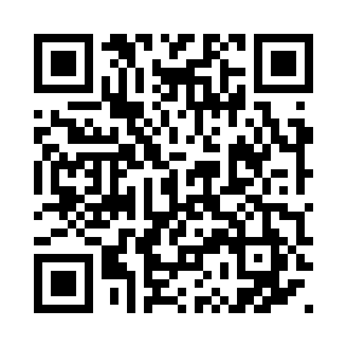

# Survey Feedback App

A Flask web app for collecting survey feedback and sending submitted responses by email.

## Survey link

Scan the QR code or open the [Chesroc Catering Services - Stubbcreek Survey](https://survey-31kp.onrender.com/).



## Requirements

- Python 3.12 or later
- A Resend account and API key for sending email

## Setup

Create and activate the virtual environment:

```powershell
python -m venv .venv
.\.venv\Scripts\Activate.ps1
```

Install the dependencies:

```powershell
python -m pip install -r requirements.txt
```

## Email configuration

Copy `.env.example` to `.env` and replace the placeholder values:

```text
RESEND_API_KEY=your-resend-api-key
SENDER_EMAIL=onboarding@resend.dev
RECEIVER_EMAIL=your-recipient@example.com
```

The application loads these values from `.env` when it starts. Never commit `.env` or share your Resend API key. For production, verify your own sending domain in Resend and use an address from that domain as `SENDER_EMAIL`.

Alternatively, set the variables in the active PowerShell terminal before starting the app:

```powershell
$env:RESEND_API_KEY = "your-resend-api-key"
$env:SENDER_EMAIL = "onboarding@resend.dev"
$env:RECEIVER_EMAIL = "your-recipient@example.com"
```

## Run the app

```powershell
python app.py
```

Open http://127.0.0.1:5000 in a browser.

## Project structure

```text
examples/smtp_email_example.py  Standalone email example
templates/index.html   Survey form
templates/email_feedback.html  HTML email template
templates/assets/chesroc-logo.svg  Company logo asset
docs/assets/survey-qr.png  PNG QR barcode
docs/assets/survey-qr.svg  SVG QR barcode
requirements.txt       Python dependencies
.env.example           Environment variable template
```

## Security

Do not commit credentials, `.env` files, `.venv`, or Python cache files. If an app password has been exposed, revoke it in Google Account settings and create a new one.
